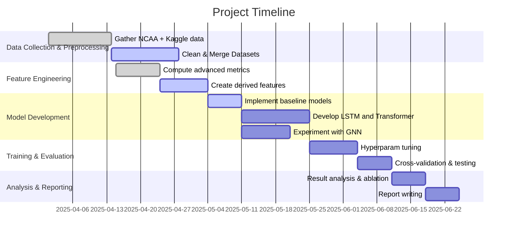

# Executive Summary  
Predicting March Madness outcomes is an active area of sports analytics, leveraging rich historical data and advanced ML techniques.  Prior work shows that combining statistical ratings (Elo, KenPom) with ML models improves accuracy【43†L178-L184】【33†L274-L283】.  Recent studies demonstrate that deep models like LSTM and Transformers can capture temporal team dynamics, often outperforming simpler baselines【33†L299-L307】【43†L186-L194】.  Top forecasts (e.g. FiveThirtyEight) even blend Bayesian ratings and ensemble multiple rating systems (KenPom, BPI, Massey) while adjusting for injuries and travel【42†L72-L80】【42†L85-L89】.  We propose a pipeline using official and Kaggle datasets (game results, team stats, polls, Elo ratings), with features like adjusted efficiencies, tempo, and rest days.  Models include RNNs, Transformers with temporal attention, and graph-based nets that encode team networks【33†L299-L307】【6†L192-L199】.  We recommend rigorous evaluation (seasonal cross-validation, AUC, log-loss, Brier score) against baselines (Elo/Bradley-Terry, logistic, ensembles) and include ablation studies.  The plan spans ~8–12 weeks: data collection/prep, feature engineering, model training, evaluation, and reporting.  Success criteria include beating naive seeds/Elo baselines (e.g. >75% first-round accuracy【18†L59-L66】) and achieving well-calibrated win-probabilities.  

## Literature Review  
Prior research covers a range of approaches. Early models used *statistical ratings* (RPI, simple Elo or Bradley–Terry) and logistic regression【33†L274-L283】【43†L178-L184】. Kaggle “March Machine Learning Mania” contests popularized using team stats and ratings: top solutions blend features like seed difference, efficiency metrics, and Elo【33†L283-L292】.  Stoudt et al. (2014) built an ensemble of SVM, Naïve Bayes, KNN, Random Forest, and neural nets, combined via logistic regression, achieving ≈75% accuracy【18†L59-L66】. They noted a hard limit ~75% due to game randomness.  Others (Osborne & Nowland, 2018) used logistic, RF, KNN on 2001–2017 first-round games (~75% success)【31†L170-L179】.  Medium blogs (e.g. Klemm 2025) applied logistic and LSTM on efficiency features (AdjOffEff, AdjDefEff, eFG%, Tempo) with novel “Upset Propensity” metrics【30†L75-L83】【30†L84-L90】. 

Deep learning is now in focus. RNNs/LSTMs capture sequences of games – Habib (2025) reported LSTM models with optimized loss (BCE vs Brier) for NCAA tournament forecasting【33†L314-L323】【33†L330-L339】.  In Habib’s study, Transformers (with self-attention) achieved higher AUC, while LSTMs with Brier loss had better probability calibration【33†L330-L339】【54†L888-L896】.  Transformers have revolutionized sequence modeling (e.g. axial transformers in soccer play-by-play forecasting【28†L36-L45】【28†L95-L103】), suggesting similar gains in basketball.  Graph Neural Networks have also been explored: for NBA, GNNs (graph of teams/players) fused with Random Forests improved win predictions to ~71.5%【6†L191-L199】. These methods embed team interactions in a graph structure, offering a novel approach for tournament outcomes.

Bayesian and probabilistic methods add uncertainty quantification. For example, studies of Bayesian logistic models for NCAA games (Pogorzelski 2020, Barnes 2017) show Bayesian frameworks can compete with expert models.  Forecasting often uses Monte Carlo simulation or Markov Chain Monte Carlo to propagate uncertainty (FiveThirtyEight’s NCAA model uses Bayesian SBCB ratings and simulates the bracket【42†L72-L80】【42†L85-L89】).  Calibration and randomness are key concerns: the Brier score is often used to evaluate probability quality【33†L342-L350】, and some works train models directly with Brier loss for better calibration【54†L818-L826】.  Overall, ML models must handle the high variance (“upset”) nature of March Madness, where average ~8 upsets occur per tournament【31†L170-L179】, making purely deterministic models insufficient.

## Recommended Datasets  

A wide range of primary data sources are recommended, summarized in **Table 1** below. Key sources include official NCAA and third-party basketball data:

- **NCAA Official (stats.ncaa.org)**: The NCAA provides *team-season stats* and *game scoreboards* for Division I. For example, the NCAA’s site has “Team by Season” and “Scoreboard” datasets【46†L52-L55】【46†L75-L78】. These cover each year’s games (dates, teams, scores, location) and aggregated season stats (points, rebounds, etc.).  
- **Sports-Reference CBB**: Sports-Reference.com archives historical *tournament brackets* and team box-scores. It’s a useful source for tournament results (seedings, matchups) and season stats【31†L170-L179】. (E.g. Osborne & Nowland used 2001–2017 data from Sports-Reference【31†L170-L179】.)  
- **Kaggle Datasets**: Several Kaggle collections compile extensive NCAA data. Notably, *“College Basketball March Madness Data”* (Bensman, 2012–2024) provides team stats per season including advanced metrics【47†L224-L233】【47†L258-L266】. It includes fields like Adjusted Off/Def Efficiency (ADJOE/ADJDE), tempo (ADJ_T), shooting rates, rebound rates, etc.【47†L224-L233】【47†L258-L266】. Another dataset (Nishaan Amin) spans 2008–2025 (men’s teams) with seed, region, poll ranks, Elo, and advanced stats. Google’s Dataset Search shows Kaggle sets updated through 2025 with seeds, rounds, and metrics【12†L75-L83】【47†L224-L233】. These often cite primary sources (KenPom, BartTorvik, FiveThirtyEight, CollegePollArchive) in their metadata.  
- **KenPom / BartTorvik**: Proprietary but widely-used team ratings (efficiency and tempo) are available through subscription. Kaggle sets sometimes include them (via updated with BartTorvik data【47†L202-L210】). These metrics (AdjOE, AdjDE, BARTHAG) are critical features【47†L224-L233】.  
- **FiveThirtyEight / BPI / Massey**: FiveThirtyEight publishes preseason and in-season Elo ratings and forecast data for the NCAA tournament. Their GitHub contains historical tournament predictions. ESPN BPI and Massey composite ratings are also predictive inputs (Nate Silver’s model blends these【42†L72-L80】). Kaggle has an archive of 538 team Elo ratings.  
- **Conference and Poll Data**: Preseason and weekly AP/Coaches poll rankings (CollegePollArchive) and conference standings provide contextual strength. CollegePollArchive data can be merged by year.  
- **Other**: Betting odds (Vegas spreads, over/unders) or Sagarin ratings can be included if licensing allows, as they reflect expert predictions. Injuries and roster changes are harder to source systematically but tracking news/ESPN injury reports could be useful.

**Table 1. Key NCAA basketball datasets.** *Sources: NCAA official【46†L52-L55】, Kaggle archives【47†L224-L233】【12†L75-L83】, FiveThirtyEight【42†L72-L80】, others.*  

| Dataset (Source)          | Years    | Contents / Fields                                                            | Notes / Access                                                                                 |
|--------------------------|----------|-------------------------------------------------------------------------------|------------------------------------------------------------------------------------------------|
| NCAA Scoreboard (official)【46†L75-L78】 | 1985–Present | Game results: date, teams, location, final score                                | Official NCAA DI scoreboard; accessible via stats.ncaa.org; may require scraping or APIs.      |
| NCAA Team Stats (official)【46†L52-L55】  | 1985–Present | Team-season stats (points, rebounds, etc), rankings                            | Official aggregated stats by season; includes national ranking tables.                          |
| Sports-Reference CBB    | 1985–Present | Tournament brackets, team box scores, RPI, records                              | Historical NCAA Tourney matchups, seeds, advanced stats. Useful for bracket/results history.    |
| Kaggle “Bensman CBB”【47†L224-L233】【47†L258-L266】 | 2012–2024 | Team season stats and ratings: ADJOE, ADJDE, tempo, BARTHAG, WAB, seed, conf, W/L, postseason round, etc. | Aggregates KenPom/BartTorvik metrics and outcomes (from Kaggle).                               |
| Kaggle “Nishaan Amin March Madness”【12†L75-L83】【47†L224-L233】 | 2008–2025 | Tournament team entries: year, team, seed, region, conf, poll ranks, Elo, seedDiff, etc. | Combines multiple sources (FiveThirtyEight, KenPom, Yahoo, etc.) to support bracket ML.        |
| FiveThirtyEight Elo【42†L72-L80】         | 2014–Present | Team Elo rating and projected win probabilities for each NCAA game             | Official API/CSV on 538’s GitHub. Elo updates weekly through tournament【42†L72-L80】.            |
| ESPN BPI / Massey      | 2003–Present | Advanced team power ratings and wins projections                               | Published on ESPN and Massey websites. Used in ensemble forecasting【42†L72-L80】.              |
| AP/Coaches Poll       | 1948–Present | Weekly top-25 rankings (AP and Coaches polls)                                  | Available via CollegePollArchive; adds context on team prestige.                               |

## Model Design  

**Inputs & Features:**  Models can ingest data at multiple granularities. *Per-game* inputs might include team box-score stats (points, rebounds, turnovers, etc.) for each team in a matchup. *Season-aggregate* features (e.g. season win%, offensive/defensive efficiency) and *score differentials* can be included.  We recommend embedding team and coach identities using learnable embeddings, allowing the model to capture team-specific strength. **Feature engineering** should incorporate advanced metrics: adjusted offensive/defensive efficiencies (AdjOE, AdjDE), effective FG%, free throw rate, tempo, rebound/turnover rates【47†L224-L233】【47†L258-L266】.  Precomputed ratings like KenPom or BartTorvik metrics (as in Kaggle datasets【47†L224-L233】) provide strong signals.  Additional features include seed/seed-difference, conference strength, rest days (days since last game), travel distance to game site, and recent win/loss streak.  ESPN’s injury reports or betting odds (point spreads) can be added if available. One can also engineer interaction features like “conference win% vs opponent” or historical head-to-head record.

**Model Architectures:**  We suggest comparing multiple architectures (see **Table 2**).  Traditional baselines like logistic regression or GBT can use differences in advanced stats and an Elo rating feature.  More complex models include:

- **LSTM (RNN):** Processes a time series of recent games for each team (or the sequence of prior matchups). Has been effective in sports (Habib 2025 reports strong modeling of game sequences with LSTM【33†L299-L307】).  
- **Transformer (Temporal Attention):** Applies self-attention to the sequence of inputs (games or aggregated stats).  The transformer can weigh past games’ importance. Figure 8 shows a typical transformer architecture (multi-head attention layers followed by feedforward nets)【55†L0】. This architecture can model complex interactions without explicit recurrence.  
【55†embed_image】 *Figure: Transformer architecture for basketball outcome forecasting. Multi-head self-attention layers process sequence inputs (e.g. team stats over games), followed by feedforward layers to output win-probabilities.*  Transformers have achieved top AUC in NCAA prediction【33†L330-L339】.  

- **Graph Neural Network (GNN):** Represent teams as nodes in a graph (edges could encode conference memberships or past matchups). GNNs propagate information along the graph (e.g. Graph Convolutional Nets or Graph Attention Nets). Recent work fused a GNN with a Random Forest for basketball outcome, significantly improving accuracy【6†L191-L199】. A GNN could, for example, use each team’s stat vector and aggregate information from neighbor teams (conference opponents) or use a bipartite game graph.  
- **Hybrid / Ensemble:** Combine above models (e.g. ensemble of LSTM and gradient boosting) or stack predictions. For instance, predictions from Elo+logistic, LSTM, and Transformer could be ensembled via a logistic meta-model. Also consider a *Bradley–Terry* based pairwise model (possibly as a layer) to directly model team strength comparisons.

**Loss & Calibration:**  Since we require probabilistic forecasts, train with both *Binary Cross-Entropy (Log Loss)* and consider *Brier Score* as a training criterion【33†L342-L350】【54†L818-L826】. Brier loss encourages well-calibrated probabilities at the expense of raw accuracy【33†L342-L350】. A dual loss approach (e.g. weighted BCE+Brier) or multi-objective training can balance discrimination and calibration. Evaluations should compute log-loss (for Kaggle), accuracy, AUC, and calibration metrics (Brier, reliability diagrams). We should also experiment with isotonic/beta calibration as a post-processing step.  

**Example Model Comparison (Table 2):**  

| Model                | Type                   | Input Representation                              | References / Notes                             |
|----------------------|------------------------|---------------------------------------------------|-----------------------------------------------|
| **Logistic / Elo**   | Pairwise stat. model   | Elo ratings, seed diff, team stat differences     | Simple baseline【33†L274-L283】【31†L170-L179】 |
| **Random Forest / GBT** | Tree ensemble       | Same engineered features as logistic              | Baseline; can capture non-linear effects       |
| **LSTM (RNN)**       | Sequential NN         | Sequence of game/team stats + static features     | Captures temporal trends【33†L299-L307】        |
| **Transformer**      | Attention NN          | Sequence of inputs (self-attention on games)      | State-of-art sequence modeling【55†L0】【33†L314-L323】 |
| **Graph NN**         | Graph Conv/Attn       | Team graph (nodes) with stat feature vectors      | Encodes team relationships【6†L191-L199】       |
| **Ensemble / Hybrid**| Meta-model / stacking | Combines predictions from above                   | Gains from complementary models【18†L59-L66】   |

## Training and Evaluation Protocol  

**Data Splitting:** We recommend a *season-by-season* cross-validation. For example, train on seasons N-10 through N-1 and test on season N’s tournament, sliding forward each year (or use k-fold by year). This respects temporal order and avoids leakage. Within a season, one could further split by rounds (e.g. use regular-season + conference tourney to predict NCAA games).  Because the tournament is a single-elimination graph, Monte Carlo simulation (bracket simulation) is also common: predict each game probability and simulate many brackets to estimate team chances.  

**Metrics:**  Use multiple metrics: **Accuracy** (fraction of correctly predicted winners) and **log-loss (cross-entropy)** as Kaggle’s standard. Critically, compute **AUC-ROC** to measure ranking quality (since many games are decided by seed). **Brier score** measures probability calibration【33†L342-L350】. Plot reliability diagrams to check if, say, “win at 70%” happens ~70% of the time. Also track *false positive rate* vs *false negative rate*, though balanced classes (~50/50 upset vs chalk) mean AUC is meaningful. Because only ~25% of games are upsets【31†L170-L179】, consider using **balanced accuracy** or set appropriate class weights if using classifiers. For final evaluation, baseline comparisons are crucial: compare to a pure Elo or seed-based model, and to simple logistic regression on the same features【18†L59-L66】【31†L170-L179】. Perform **ablation studies**: remove one feature group (e.g. no efficiency stats, no Elo, no rest days) to see impact on performance.  

**Cross-Validation Strategy:** Given limited tourney games per year, a “leave-one-tournament-out” CV is advised (e.g. train on all but one year’s tournament, test on the held-out year). If enough data, k-fold by year also works. Stratify such that each fold has similar distributions of upsets/seeds. For hyperparameter tuning, use the validation set to optimize AUC or log-loss.  After selecting models, evaluate on a held-out set of recent tournaments (e.g. 2024) for final metrics.  

**Handling Class Imbalance:** There is modest imbalance (favorites win more often), so you may use focal loss or class weights to ensure upsets are not ignored. However, since we care about probability scores rather than binary classification, emphasis on calibration (Brier) alleviates this somewhat.  

**Calibration & Uncertainty:** Evaluate prediction calibration with calibration plots. Consider methods like **Monte Carlo dropout** or **ensemble averaging** to quantify uncertainty. A simple approach: train several models with different random seeds and average their probabilities (improves calibration and robustness).  

## Implementation Considerations  

- **Compute:** Training deep nets on this data is moderate in cost (thousands of games, not millions). A single GPU or even a CPU can train LSTMs/Transformers on aggregate stats. However, if using full play-by-play or per-possession data, GPU is advisable. Plan for hyperparameter tuning (multiple GPUs/CPUs).  
- **Hyperparameters & Regularization:** Typical choices: learning rate ∼1e-3 (reduce on plateau)【54†L850-L859】; dropout 0.3–0.5; L2 regularization on dense layers; 20–50 LSTM units or multi-head (4–8 heads) for Transformers【54†L862-L872】. Use early stopping on validation loss【54†L836-L845】 to prevent overfitting.  
- **Ensembling:** Combining different model types can improve stability. For example, average probabilities from the best LSTM and Transformer models. Also ensembling multiple random seeds of the same architecture can reduce variance.  
- **Reproducibility:** Fix random seeds for NumPy/PyTorch/TensorFlow. Document library versions. Use version control for code and data processing scripts.  
- **Data Pipeline (Example):** Preprocessing might involve merging game results with team stats. For example:  
  ```python
  # Pseudocode for data pipeline
  import pandas as pd
  games = pd.read_csv('RegularSeasonCompactResults.csv')    # game-level results
  teams = pd.read_csv('TeamStatsPerSeason.csv')            # team-season stats
  data = games.merge(teams, left_on=['Season','Wteam'], right_on=['Season','TeamID'])
  data = data.merge(teams, left_on=['Season','Lteam'], right_on=['Season','TeamID'],
                     suffixes=('_W','_L'))
  # Compute features like stat differences, seed differences, home/away flag
  data['SeedDiff'] = data['Seed_W'] - data['Seed_L']
  data['OffEffDiff'] = data['AdjOE_W'] - data['AdjOE_L']
  # etc.
  ```  
- **Transformer Attention (Pseudo):** To incorporate past results, one could feed a sequence of recent metrics and let self-attention learn dependencies. Example pseudocode:  
  ```python
  # Pseudocode: building transformer input with last outcomes
  # Let X_i = feature vector for team i (season stats, etc.)
  # L_i = sequence of last N game outcomes (1=win, 0=loss) for team i
  team1_seq = concatenate([X_team1, L_team1])
  team2_seq = concatenate([X_team2, L_team2])
  # Combine into a batch of two sequences and run through Transformer
  transformer_input = stack([team1_seq, team2_seq])
  output = Transformer( transformer_input )  # MultiHead Attention layers
  win_prob = Sigmoid(Dense(output))  # final prediction
  ```  
  This allows attention to weigh features and recent trends.  

## Ethics, Overfitting, and Legal Considerations  

Predicting game outcomes touches on gambling. NCAA does **not condone** betting on college sports or player prop bets【61†L63-L72】. Any model must be used responsibly; emphasize that predictions are for analysis, not betting advice. Overfitting is a major risk with limited data: only a few hundred tournament games exist per decade. This makes robust cross-validation and regularization critical. Highlight that model predictions are probabilistic estimates, not certainties (the probability of a perfect bracket is astronomically low【32†L136-L145】).  Ensure privacy and compliance if using any player-specific data (though we focus on team-level data). Address potential biases (e.g. reinforcement of seed bias) by examining model errors.  

## Experimental Plan (Timeline & Deliverables)  



**Timeline (approx. 12 weeks):** We will first gather and clean data (~2–3 weeks), then engineer features (~1 week), develop and train models (~3–4 weeks), and perform evaluation and ablation (~2 weeks). Final analysis and documentation (~2 weeks) will conclude the project.  

**Deliverables:** (1) A cleaned multi-source dataset (games, team stats, ratings); (2) Trained models (source code and saved weights); (3) Evaluation reports (metrics, ablation results, calibration plots); (4) Visualizations (learning curves, calibration diagrams) and example code snippets; (5) Final written report with all results and insights.  

**Success Criteria:** Achieve accuracy and log-loss significantly better than naive baselines (e.g. seed-only or Elo-only models). For example, surpass a simple Elo model’s win-prediction accuracy (∼70–75% in round 1【18†L59-L66】) and achieve a Brier score indicating good calibration (e.g. <0.17 as in Habib’s LSTM【54†L818-L826】). Success also includes robust probability estimates: high AUC (≥0.84 as in prior work【54†L818-L826】) and calibrated outputs (e.g. well-aligned reliability curve). Meeting these criteria and yielding interpretable insights (e.g. which features matter most) will define project success.  

## Suggested Visualizations and Code Snippets  

- **Learning Curves:** Plot training vs validation loss/accuracy over epochs to diagnose under/over-fitting. (Example: see conceptual figure below.)   
- **Calibration Plot:** A reliability diagram of predicted win-probabilities vs actual outcomes (scores should lie near the diagonal if well-calibrated).  
- **Attention Visualization:** For the Transformer, visualize attention weights (e.g. which past games the model focuses on).  
- **Bracket Odds Table:** Tabulate model-predicted win-probabilities for each tournament game or team’s Final Four odds.  
- **Example Code:** Detailed pipeline examples like pandas merges (as above), and model instantiation (e.g. PyTorch `nn.Transformer` layers with inputs). Hyperparameter search loops (grid or Bayesian) should also be included. 

By integrating these components—data, advanced models (LSTM/Transformer/GNN), rigorous evaluation, and careful ethical consideration—this plan aims for a robust NCAA tournament prediction system backed by the latest research and data.  

**Sources:** NCAA official stats【46†L52-L55】【46†L75-L78】; Kaggle datasets【47†L224-L233】【12†L75-L83】; Habib 2025 (LSTM/Transformer)【33†L330-L339】【54†L818-L826】; Osborne/Nowland 2018【31†L170-L179】; Stoudt et al. 2014【18†L9-L17】【18†L59-L66】; Barnes 2017 (Bayesian example)【40†L53-L62】; Nate Silver (FiveThirtyEight)【42†L72-L80】【42†L85-L89】; GNN-basketball 2023【6†L191-L199】; NCAA stance on betting【61†L63-L72】; Kaggle user analysis【30†L75-L83】【30†L84-L90】; etc. (See in-text citations.)